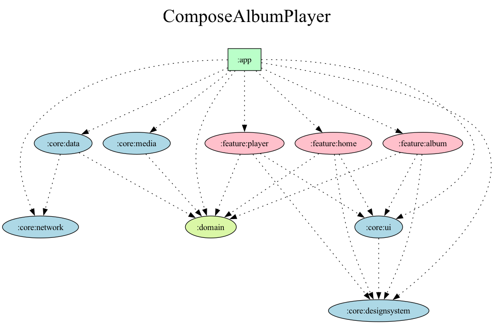

# Compose Album Player

Jetpack Compose와 Clean Architecture로 구현된 Android 음악 플레이어 앱입니다.
[Audius](https://audius.co) API를 통해 트렌딩 앨범을 스트리밍합니다.

## ✨ 주요 기능

| 앨범 목록 | 트랙 목록 | 플레이 화면 | 알람 화면 |
| --- | --- | --- | --- |
|  |  |  |  |

- **음악 스트리밍**: Audius API 기반 트렌딩 앨범 재생
- **Notification 컨트롤**: 잠금화면/알림창에서 재생 제어 및 앨범 아트 표시
- **스마트 프리로드**: 다음/이전 곡 자동 프리로드로 끊김 없는 재생
- **자동 캐싱**: LRU 기반 디스크 캐싱으로 데이터 절약
- **동적 호스트 선택**: Audius Discovery API로 최적 서버 자동 선택

## 🏗️ 아키텍처

- **Clean Architecture**: Domain, Data, Presentation 계층 분리
- **MVI 패턴**: BaseViewModel을 통한 단방향 데이터 흐름
- **Multi-module**: Feature 모듈과 공유 Core 모듈 구조

## 🛠️ 기술 스택

| 분류 | 기술 |
|------|------|
| **UI** | Jetpack Compose, Material3 |
| **DI** | Hilt |
| **비동기** | Kotlin Coroutines, Flow |
| **네트워크** | Retrofit, OkHttp, Kotlinx Serialization |
| **이미지** | Coil |
| **미디어** | Media3 ExoPlayer, MediaSessionService |

## 🎧 미디어 시스템

### 캐싱 정책
- 디바이스 가용 공간의 3% (50MB ~ 500MB)
- LRU 방식으로 오래된 캐시 자동 삭제
- 청크 크기 2MB (음악에 최적화)

### 버퍼링 정책 (음악 최적화)

| 항목 | 설정값 | 기본값 | 효과 |
|------|--------|--------|------|
| minBuffer | 30초 | 50초 | 음악은 비트레이트가 낮아 충분 |
| maxBuffer | 2분 | 50초 | 다음 곡까지 여유있게 버퍼링 |
| bufferForPlayback | 1.5초 | 2.5초 | 빠른 재생 시작 |
| backBuffer | 30초 | 0초 | 뒤로 감기 즉시 반응 |

### 프리로드 정책 (DefaultPreloadManager)
- **다음/이전 곡**: 30초 프리로드 (MediaSource 준비 + 캐시 저장)
- **2칸 떨어진 곡**: 트랙 선택까지만 준비
- CustomCommand를 통한 App ↔ Service 프로세스 간 통신

## 📦 모듈 구조

```
app/                    # 메인 애플리케이션 모듈
core/
  ├── data/            # Data 계층 구현체
  ├── designsystem/    # 디자인 시스템 (테마, 컬러, 타이포그래피)
  ├── media/           # 미디어 플레이어 (MediaSessionService, ExoPlayer, 캐싱)
  ├── network/         # 네트워크 계층 (Retrofit, 동적 호스트 선택)
  └── ui/              # 공통 UI 컴포넌트 & BaseViewModel
domain/                # 비즈니스 로직 & 모델
feature/
  ├── album/           # 앨범 상세 & 플레이어 기능
  └── home/            # 홈 화면 기능
```

### 모듈 의존성 그래프



## 📚 기술 문서

- [캐싱 시스템](docs/CACHING.md)
- [버퍼링 및 프리로드 시스템](docs/PRE_LOADING.md)

## 📄 라이선스

이 프로젝트는 MIT 라이선스 하에 배포됩니다.
